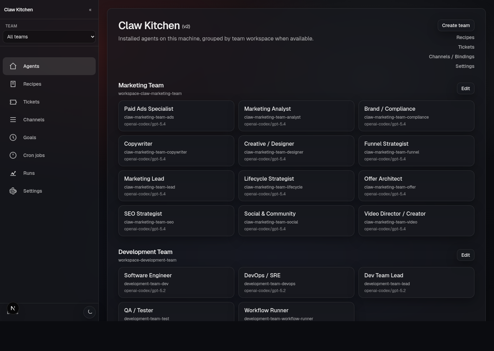

# ClawKitchen

## What ClawKitchen is

ClawKitchen is the local-first UI for operating a machine that runs OpenClaw and ClawRecipes.

It takes the parts of the system that would otherwise be scattered across terminal commands, workspace folders, config files, and markdown documents, and gives you one place to inspect and operate them.

In practice, ClawKitchen is where you go to:

- see which agents are installed on this machine
- scaffold new agents and teams from recipes
- inspect and edit team files, skills, workflows, and cron jobs
- follow workflow runs and approvals
- work with file-backed tickets and goals
- manage message-channel bindings and a few key runtime behaviors

## Why it exists

ClawRecipes and OpenClaw are powerful because they are file-first and scriptable.

That is a feature, not a bug. But it also means the day-to-day operator experience can get rough fast. Once you have multiple agents, multiple teams, scheduled jobs, workflow runs, approvals, and tickets, the system becomes harder to understand at a glance.

ClawKitchen exists to make that operational layer easier to work with without replacing the file-first model underneath it.

It is not meant to be a separate hosted backend with a mystery database. It is the dashboard for the machine and workspaces you already own.

## How it relates to ClawRecipes

A useful mental model is:

- **OpenClaw** runs agents, tools, channels, sessions, and automation
- **ClawRecipes** defines reusable recipes for agents and teams
- **ClawKitchen** is the UI for browsing, scaffolding, editing, and operating those systems

So ClawKitchen is not the recipe engine itself. It is the control surface around it.

## What you can do in ClawKitchen

The product currently gives you a real operations surface for:

- **Home / Agents** — view installed agents grouped by workspace/team
- **Recipes** — scaffold agents or teams from builtin and custom recipes
- **Teams** — manage team structure, files, skills, cron, workflows, memory, and orchestrator visibility
- **Workflows** — create and edit file-first workflow definitions
- **Runs** — inspect workflow runs, statuses, approvals, and details
- **Tickets** — manage file-backed work items across backlog, in-progress, testing, and done
- **Channels** — manage messaging bindings/config
- **Goals** — create and track durable goals tied to teams
- **Cron jobs** — inspect and manage scheduled jobs
- **Settings** — control a small set of operational behavior like cron installation mode

## The design philosophy

ClawKitchen is built around a few principles:

- **local-first** — it reflects the machine and workspaces you already have
- **file-backed** — the source of truth stays in files/config whenever possible
- **operational** — it is meant to help you run teams, not just admire them
- **human-readable** — it should make agent systems easier to inspect and understand

That combination matters. The goal is not to hide the underlying system. The goal is to make the underlying system easier to operate.

## Who ClawKitchen is for

ClawKitchen is most useful for people who are:

- actively running one or more ClawRecipes-powered teams
- iterating on recipes and workflows
- reviewing runs and approvals
- managing file-backed operational state through a UI instead of only through the terminal

If you only need one-off CLI actions, you may not need Kitchen very often.
But once your setup starts to grow, Kitchen becomes the fastest way to understand what is happening.

## Start here

If you are new to ClawKitchen, the best next pages are:

- [Product tour](/clawkitchen/product-tour)
- [Install and access](/clawkitchen/install-and-access)
- [Recipes and scaffolding](/clawkitchen/recipes-and-scaffolding)
- [Teams](/clawkitchen/teams)
- [Workflows](/clawkitchen/workflows)
- [Practical examples](/clawkitchen/examples)
