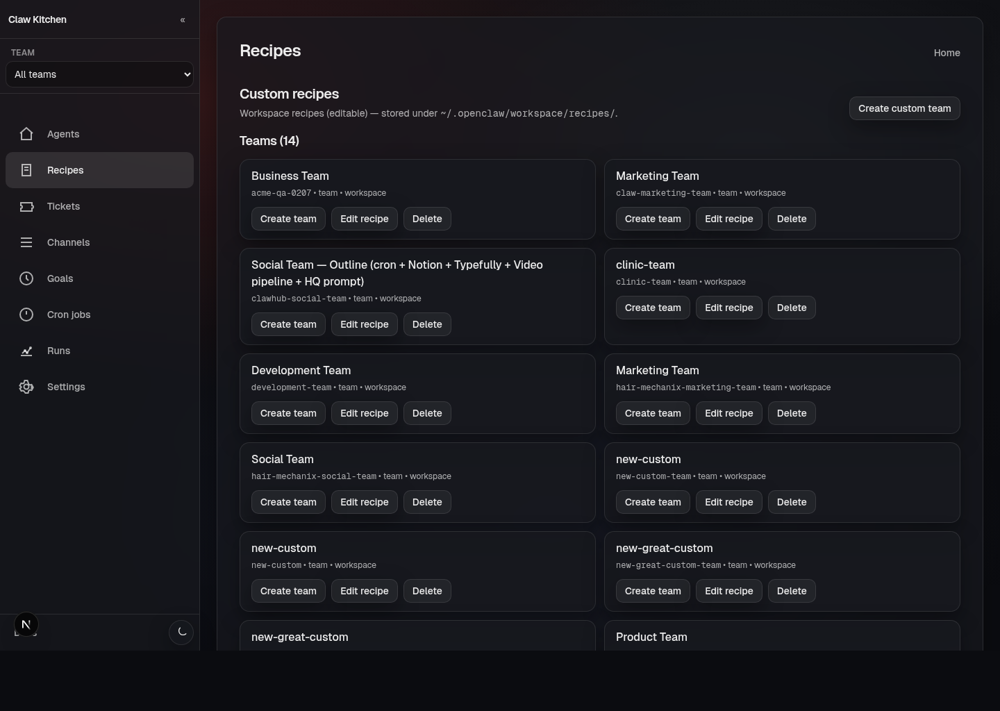

# Recipes and scaffolding

## What the Recipes page is for

The Recipes page is where reusable definitions become real agents and teams on your machine.

In practice, this is one of the most important entry points in ClawKitchen because it turns ideas and defaults into working structure.

## Builtin vs custom recipes

ClawKitchen works with two broad recipe sources:

- **builtin recipes** — bundled with the ClawRecipes plugin
- **custom recipes** — user-editable recipe files stored in your workspace

That distinction matters:

- builtin recipes are the shipped defaults
- custom recipes are where your own variations and working patterns should live

A good default rule is:

- use builtin recipes to get started quickly
- create or evolve custom recipes when the setup becomes yours

## Common things you do here

From Recipes, you can:

- create a team from a recipe
- create an agent from a recipe
- create a custom team recipe
- inspect recipe details
- edit custom recipes
- remove custom recipes

## Example: create a team from a builtin recipe

Typical flow:

1. Open **Recipes**
2. Pick a team recipe
3. Choose **Create team**
4. Set the team id
5. Decide whether cron jobs should be installed or reconciled during scaffold
6. Finish scaffold and move into the Team editor

This is the fastest way to get a real multi-role workspace up and running.

## Example: create an agent from a recipe

Typical flow:

1. Open **Recipes**
2. Pick an agent recipe
3. Choose **Create agent**
4. Set the agent id and display name
5. Open the new agent in the editor to refine identity, files, model, or skills

This is a good workflow when you want a focused specialist without scaffolding an entire team.

## Example: create a custom team

If builtin recipes get you close but not all the way there, ClawKitchen also supports creating a custom team recipe.

That is useful when you want:

- your own role mix
- custom instructions
- workspace-specific conventions
- a reusable team structure that you can evolve over time

## Important mental model

ClawKitchen helps you scaffold from recipes, but the recipes themselves remain file-backed artifacts.

That is the reason the system is repeatable: you are not just clicking UI state into existence. You are generating durable structures that can be reviewed, reused, versioned, and improved.

## When to use custom recipes

Custom recipes become the right move when you notice that you are repeatedly changing the same things after scaffold.

That is usually a sign that the pattern should live in the recipe itself instead of in post-creation cleanup.
