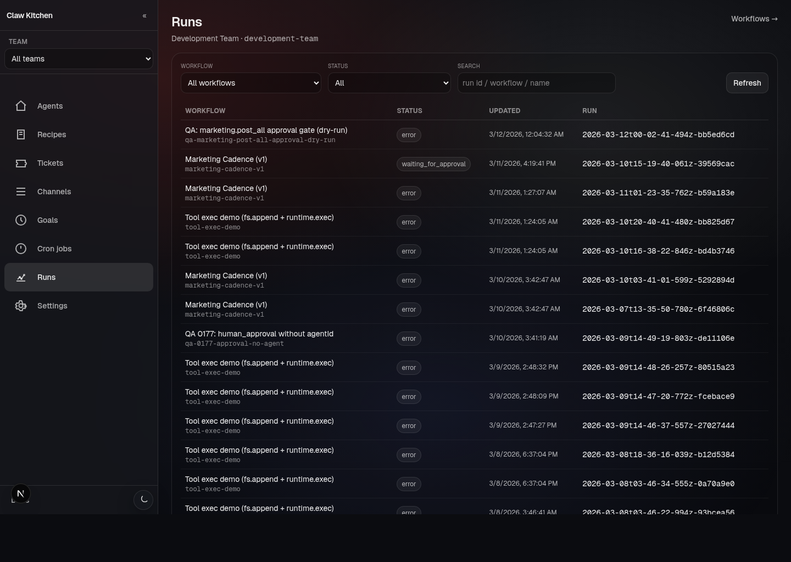

# Runs

## What the Runs pages are for

Runs are where workflows stop being definitions and start being operational history.

ClawKitchen exposes run views so you can answer practical questions like:

- what ran recently?
- which team did it belong to?
- did it succeed, fail, or wait for approval?
- what happened inside the run?

## Two views: global and per-team

ClawKitchen exposes runs in two ways:

- **global runs** — a cross-team view of workflow activity
- **team runs** — a filtered view focused on one team's workflows

Use the global view when you want to understand system activity across teams.
Use the team view when you are actively working inside a specific team.

## What you can do there

The current runs surface supports:

- filtering by team, workflow, and status
- inspecting individual run detail
- checking approval state
- understanding whether a run is still active or already completed

## Typical workflow

A common loop looks like this:

1. open a team workflow
2. trigger or observe a run
3. open **Runs**
4. filter to the relevant workflow
5. open the run detail
6. inspect status, outputs, and approval state

## What runs represent

Runs are file-backed operational artifacts tied to workflows in the workspace.

That matters because they are not just transient UI rows. They are part of the observable record of what the system did.

## Good reasons to check Runs

Use the Runs pages when you need to:

- confirm that a workflow actually fired
- see whether a run is stuck or waiting for approval
- compare multiple attempts of the same workflow
- debug why a workflow did not produce the expected result

## A good habit

If a workflow matters, make checking Runs part of the normal operator loop.

That turns workflows from “something we hope is working” into a visible, inspectable part of everyday operations.
