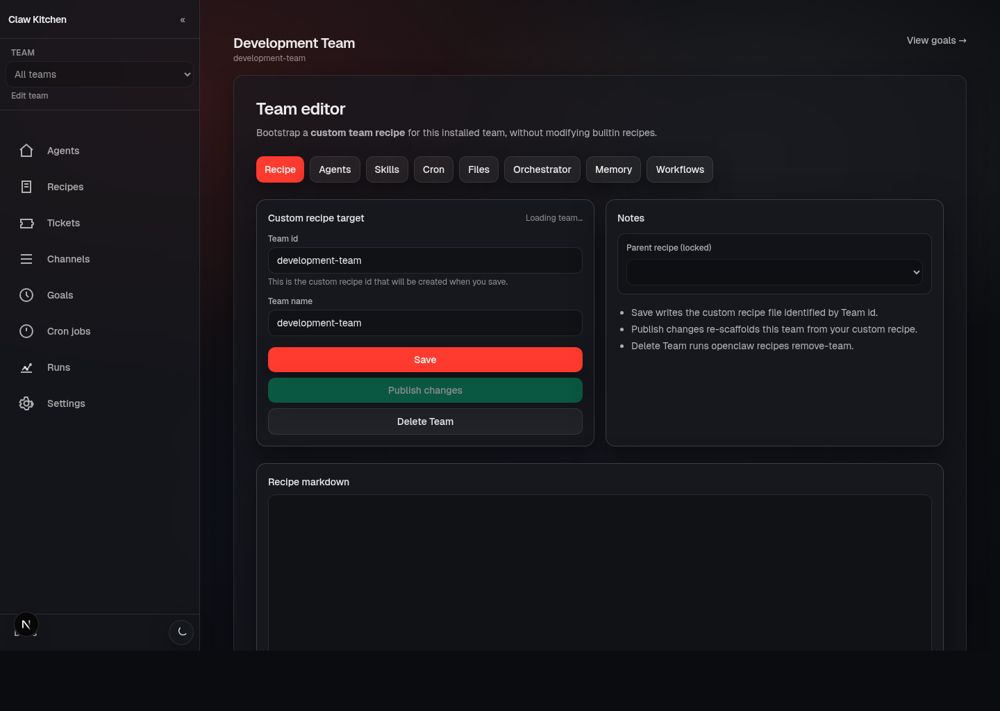

# Teams

## What the Team editor is

The Team editor is the main operating surface for a scaffolded team.

If Recipes is where teams get created, the Team editor is where they become understandable and manageable.

## What you can manage there

A team page typically exposes tabs for:

- **Recipe**
- **Agents**
- **Skills**
- **Cron**
- **Files**
- **Orchestrator**
- **Memory**
- **Workflows**

That makes the team page the place where structure, operational behavior, and working files all come together.

## What each area is for

### Recipe
Use this when you want to understand or evolve the team definition itself.

A practical use case is turning an installed team into a custom editable recipe instead of continuing to rely on a bundled default.

### Agents
Shows the agents or roles that make up the team and lets you inspect or navigate into them.

### Skills
Use this to see or install team-relevant skills that should be available across the team workspace.

### Cron
This is where scheduled behavior becomes visible and manageable for the team.

### Files
One of the most important tabs in the whole product.

The system is file-first, so direct visibility into team files is a major part of understanding what the team is actually doing.

### Orchestrator
Advanced operational visibility for swarm/orchestrator setups.

### Memory
A place to inspect memory-related artifacts and conventions tied to the team.

### Workflows
Where the team's workflow definitions live and where you branch into workflow editing and run inspection.

## Practical example

A common real-world loop looks like this:

1. scaffold a development team from a recipe
2. open the team in ClawKitchen
3. inspect files and roles
4. verify cron behavior
5. inspect workflows
6. make adjustments to the recipe or the team files as needed

That is the heart of the ClawKitchen experience: not just creating a team, but actually operating it.

## The important mindset

The Team editor is valuable because it lets you work with a real, durable team workspace through a UI.

It does not replace the workspace. It helps you see and manage it.
