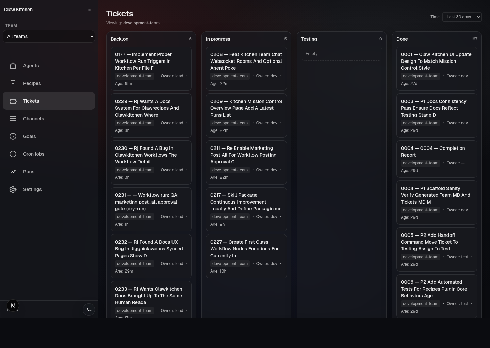

# Tickets

## What Tickets are in ClawKitchen

Tickets in ClawKitchen are file-backed work items for a team.

They are not a separate hosted issue tracker hidden behind the UI. The UI is managing the team's ticket files and making that workflow easier to operate.

## Board stages

The ticket board uses the familiar working stages:

- backlog
- in-progress
- testing
- done

That makes it useful for day-to-day coordination, but the important point is that the state is still reflected in the team's filesystem and ticket conventions.

## What you can do

From the Tickets surface, you can:

- browse the board by stage
- open ticket detail
- comment on tickets
- assign ownership
- move tickets between states
- move tickets to goals
- delete tickets when appropriate

## Why this matters

This is one of the clearest examples of the ClawKitchen philosophy.

Instead of forcing work management into a separate SaaS app, ClawKitchen gives you a UI for a file-first workflow. That keeps the work state:

- inspectable
- scriptable
- portable
- reviewable outside the browser

## Practical example

A common loop looks like this:

1. a request becomes a ticket
2. it appears in backlog
3. someone takes it into in-progress
4. comments and verification notes get added
5. it moves to testing
6. it lands in done when complete

That is straightforward in the UI, but still backed by durable files.

## Good expectation setting

If you are used to a hosted ticketing app, the important difference here is that ClawKitchen is not trying to replace the underlying file workflow. It is trying to make that workflow easier to operate.
