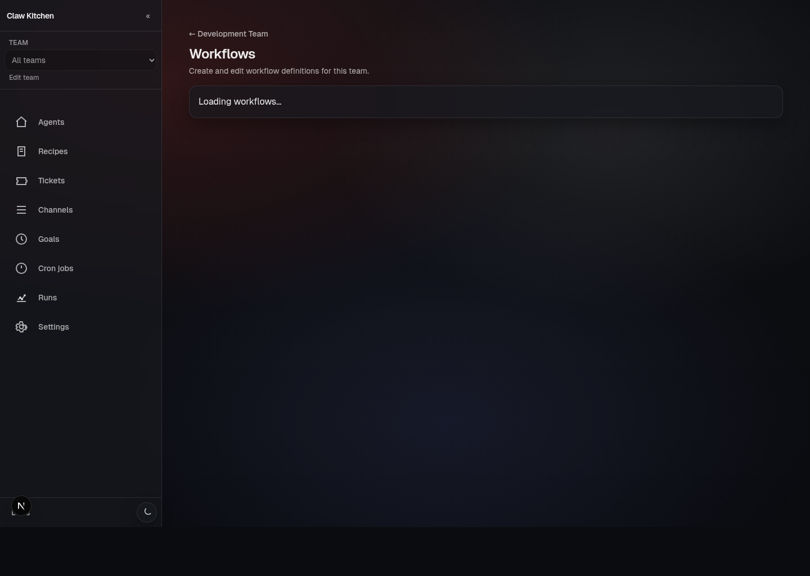

# Workflows

## What workflows are in ClawKitchen

ClawKitchen supports file-first workflows tied to a team workspace.

These workflows are real operating artifacts, not just diagram boxes in a UI.

Kitchen gives you a way to create, edit, inspect, and follow them more comfortably.

## Important model

A workflow in this system is not primarily a cloud-hosted object.

It is a file-backed definition that belongs to the team workspace.

That matters because it keeps workflows:

- inspectable
- portable
- reviewable
- consistent with the rest of the file-first ClawRecipes model

## What you can do today

In the current product, you can:

- create a blank workflow
- add an example workflow template
- edit workflow definitions
- inspect workflow runs
- work through approval-related flows

## Start with a template when possible

One of the best ways to learn the system is to add an example workflow template instead of beginning with a blank file.

That gives you something concrete to inspect, rename, simplify, and adapt before you start inventing your own structure from scratch.

## LLM nodes and plugin requirements

Some workflow capabilities depend on optional plugin support.

In particular, LLM-driven workflow nodes require the `llm-task` plugin.

If that plugin is not available, Kitchen should surface that clearly.

## What Kitchen does vs what the runtime does

ClawKitchen is the editor and operator UI.

It is not the thing that secretly replaces the runtime underneath.

The useful mental model is:

- Kitchen helps define and inspect workflows
- OpenClaw and related plugins/automation execute the actual work
- runs, approvals, and queue state are surfaced back through Kitchen

## After you create a workflow

The next step is usually to move into run inspection:

- open the team's **Runs** view
- inspect recent runs and statuses
- open a run detail page
- review approvals, outputs, and state

That is where workflows stop being definitions and start being operational artifacts.

## What to document inside your team

If a workflow becomes important, it is worth documenting:

- what triggers it
- what approval steps it expects
- what success looks like
- which channels or cron jobs it depends on

That makes the workflow much easier to operate later, especially when several people are using the same team.
